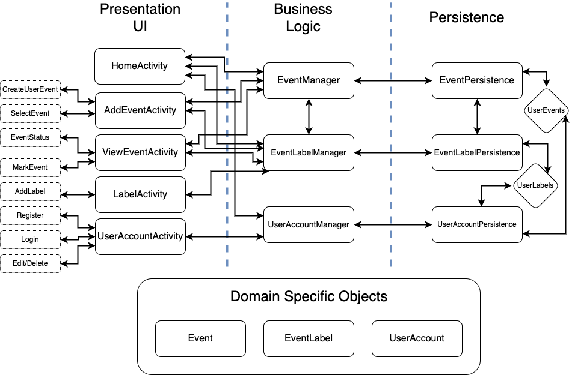
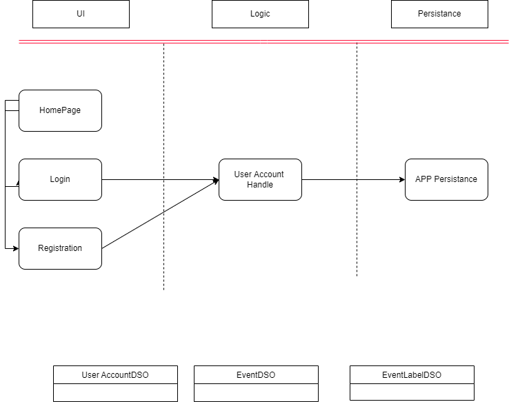
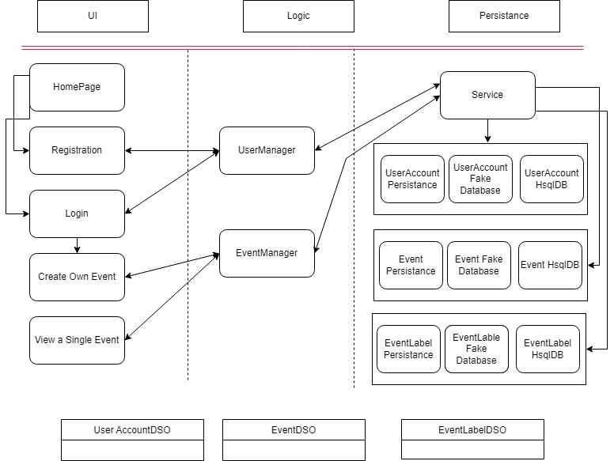
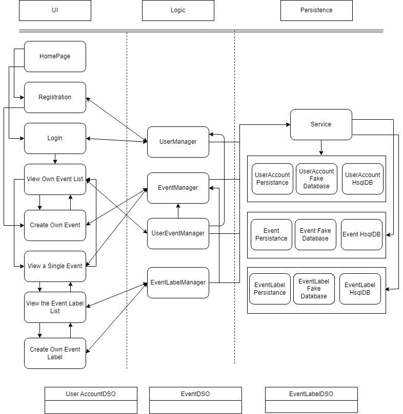

# Architecture 

Directory of classes and their layer locations. 

## Entire Project Architecture

## Iteration 1

### Presentation Layer

[HomeActivity](https://code.cs.umanitoba.ca/winter-2022-a02/group-2/time-since-a02-2/-/blob/main/app/src/main/java/comp3350/timeSince/presentation/HomeActivity.java)
- The starting screen for the app

[RegisterActivity](https://code.cs.umanitoba.ca/winter-2022-a02/group-2/time-since-a02-2/-/blob/main/app/src/main/java/comp3350/timeSince/presentation/RegisterActivity.java)
- The view for the user to register an account 

[LoginActivity](https://code.cs.umanitoba.ca/winter-2022-a02/group-2/time-since-a02-2/-/blob/main/app/src/main/java/comp3350/timeSince/presentation/LoginActivity.java)
- The view for the user to log into their account 

### Business Layer

[UserAccountManager](https://code.cs.umanitoba.ca/winter-2022-a02/group-2/time-since-a02-2/-/blob/main/app/src/main/java/comp3350/timeSince/business/UserManager.java)
- The presentation layer will call this to handle the user accounts

### Persistence Layer

[AppPersistence](https://code.cs.umanitoba.ca/winter-2022-a02/group-2/time-since-a02-2/-/blob/main/app/src/main/java/comp3350/timeSince/persistence/I_Database.java)
- Interface for the events and user accounts in the database

### Fake Database 

[FakeAppPersistence](https://code.cs.umanitoba.ca/winter-2022-a02/group-2/time-since-a02-2/-/blob/main/app/src/main/java/comp3350/timeSince/persistence/FakeDatabase.java)
- Current database implementation for events and user accounts

### Domain Specific Objects 

[Event](https://code.cs.umanitoba.ca/winter-2022-a02/group-2/time-since-a02-2/-/blob/main/app/src/main/java/comp3350/timeSince/objects/EventDSO.java)
- The event object

[EventLabel](https://code.cs.umanitoba.ca/winter-2022-a02/group-2/time-since-a02-2/-/blob/main/app/src/main/java/comp3350/timeSince/objects/EventLabelDSO.java)
- Object for the tags / labels of an event 

[UserAccount](https://code.cs.umanitoba.ca/winter-2022-a02/group-2/time-since-a02-2/-/blob/main/app/src/main/java/comp3350/timeSince/objects/UserDSO.java)
- The user / user account object

## Iteration 2

### Presentation Layer

[HomeActivity](https://code.cs.umanitoba.ca/winter-2022-a02/group-2/time-since-a02-2/-/blob/main/app/src/main/java/comp3350/timeSince/presentation/HomeActivity.java)
- The starting screen for the app

[RegisterActivity](https://code.cs.umanitoba.ca/winter-2022-a02/group-2/time-since-a02-2/-/blob/main/app/src/main/java/comp3350/timeSince/presentation/RegisterActivity.java)
- The view for the user to register an account 

[LoginActivity](https://code.cs.umanitoba.ca/winter-2022-a02/group-2/time-since-a02-2/-/blob/main/app/src/main/java/comp3350/timeSince/presentation/LoginActivity.java)
- The view for the user to log into their account 

[CreateOwnEventActivity](https://code.cs.umanitoba.ca/winter-2022-a02/group-2/time-since-a02-2/-/blob/main/app/src/main/java/comp3350/timeSince/presentation/CreateOwnEventActivity.java)
- The view for creating own event for a specific user

### Business Layer

[UserAccountManager](https://code.cs.umanitoba.ca/winter-2022-a02/group-2/time-since-a02-2/-/blob/main/app/src/main/java/comp3350/timeSince/business/UserManager.java)
- The presentation layer will call this to handle the user accounts

### Persistence Layer

[Service](https://code.cs.umanitoba.ca/winter-2022-a02/group-2/time-since-a02-2/-/blob/main/app/src/main/java/comp3350/timeSince/application/Services.java)
- Service for the database accessing

[IEventPersistence](https://code.cs.umanitoba.ca/winter-2022-a02/group-2/time-since-a02-2/-/blob/main/app/src/main/java/comp3350/timeSince/persistence/I_Database.java)
- Interface for the event persistance

[EventHsqlDB](https://code.cs.umanitoba.ca/winter-2022-a02/group-2/time-since-a02-2/-/blob/main/app/src/main/java/comp3350/timeSince/persistence/hsqldb/EventPersistenceHSQLDB.java)
- HsqlDB for the Events

[IEventLabelPersistence](https://code.cs.umanitoba.ca/winter-2022-a02/group-2/time-since-a02-2/-/blob/main/app/src/main/java/comp3350/timeSince/persistence/IEventLabelPersistence.java)
- Interface for the eventLabel persistance

[EventLabelHsqlDB](https://code.cs.umanitoba.ca/winter-2022-a02/group-2/time-since-a02-2/-/blob/main/app/src/main/java/comp3350/timeSince/persistence/hsqldb/EventLabelPersistenceHSQLDB.java)
- HsqlDB for the EventLabels

[UserPersistence](https://code.cs.umanitoba.ca/winter-2022-a02/group-2/time-since-a02-2/-/blob/main/app/src/main/java/comp3350/timeSince/persistence/IUserPersistence.java)
- Interface for the User persistance

[UserHsqlDB](https://code.cs.umanitoba.ca/winter-2022-a02/group-2/time-since-a02-2/-/blob/main/app/src/main/java/comp3350/timeSince/persistence/hsqldb/UserPersistenceHSQLDB.java)
- HsqlDB for the User

### Fake Database 

[FakeUserPersistence](https://code.cs.umanitoba.ca/winter-2022-a02/group-2/time-since-a02-2/-/blob/main/app/src/main/java/comp3350/timeSince/persistence/fakes/UserPersistence.java)
- fake database implementation for user accounts

[FakeEventPersistence](https://code.cs.umanitoba.ca/winter-2022-a02/group-2/time-since-a02-2/-/blob/main/app/src/main/java/comp3350/timeSince/persistence/fakes/EventPersistence.java)
- fake database implementation for events 

[FakeEventLabelPersistence](https://code.cs.umanitoba.ca/winter-2022-a02/group-2/time-since-a02-2/-/blob/main/app/src/main/java/comp3350/timeSince/persistence/fakes/EventLabelPersistence.java)
- fake database implementation for event labels

### Domain Specific Objects 

[Event](https://code.cs.umanitoba.ca/winter-2022-a02/group-2/time-since-a02-2/-/blob/main/app/src/main/java/comp3350/timeSince/objects/EventDSO.java)
- The event object

[EventLabel](https://code.cs.umanitoba.ca/winter-2022-a02/group-2/time-since-a02-2/-/blob/main/app/src/main/java/comp3350/timeSince/objects/EventLabelDSO.java)
- Object for the tags / labels of an event 

[UserAccount](https://code.cs.umanitoba.ca/winter-2022-a02/group-2/time-since-a02-2/-/blob/main/app/src/main/java/comp3350/timeSince/objects/UserDSO.java)
- The user / user account object

## Iteration 3

### Presentation Layer

[HomeActivity](https://code.cs.umanitoba.ca/winter-2022-a02/group-2/time-since-a02-2/-/blob/main/app/src/main/java/comp3350/timeSince/presentation/HomeActivity.java)
- The starting screen for the app

#### events

[SingleEventActivity](https://code.cs.umanitoba.ca/winter-2022-a02/group-2/time-since-a02-2/-/blob/main/app/src/main/java/comp3350/timeSince/presentation/events/SingleEventActivity.java)
- single event view for modifying the event details

[CreateOwnEventActivity](https://code.cs.umanitoba.ca/winter-2022-a02/group-2/time-since-a02-2/-/blob/main/app/src/main/java/comp3350/timeSince/[]presentation/events/CreateOwnEventActivity.java)
- create a new event for the given user

[SpinnerEventLabelList](https://code.cs.umanitoba.ca/winter-2022-a02/group-2/time-since-a02-2/-/blob/main/app/src/main/java/comp3350/timeSince/presentation/events/SpinnerEventLabelList.java)
- list of event-labels

#### eventsList

[ViewOwnEventListActivity](https://code.cs.umanitoba.ca/winter-2022-a02/group-2/time-since-a02-2/-/blob/main/app/src/main/java/comp3350/timeSince/presentation/eventsList/ViewOwnEventListActivity.java)
- veiw the list of all events for the given user

[EventListRecyclerAdapter](https://code.cs.umanitoba.ca/winter-2022-a02/group-2/time-since-a02-2/-/blob/main/app/src/main/java/comp3350/timeSince/presentation/eventsList/EventListRecyclerAdapter.java)
- adapter for the list of events view

[EventListDeleteItemAdapter](https://code.cs.umanitoba.ca/winter-2022-a02/group-2/time-since-a02-2/-/blob/main/app/src/main/java/comp3350/timeSince/presentation/eventsList/EventListDeleteItemAdapter.java)
- adapter for the delete event

#### labels

[LabelListActivity](https://code.cs.umanitoba.ca/winter-2022-a02/group-2/time-since-a02-2/-/blob/main/app/src/main/java/comp3350/timeSince/presentation/labels/LabelListActivity.java)
- list of labels for the given event

[LabelListRecyclerAdapter](https://code.cs.umanitoba.ca/winter-2022-a02/group-2/time-since-a02-2/-/blob/main/app/src/main/java/comp3350/timeSince/presentation/labels/LabelListRecyclerAdapter.java)
- adapter for the list of labels view

#### users

[RegisterActivity](https://code.cs.umanitoba.ca/winter-2022-a02/group-2/time-since-a02-2/-/blob/main/app/src/main/java/comp3350/timeSince/presentation/users/RegisterActivity.java)
- for an user to register an account

[LoginActivity](https://code.cs.umanitoba.ca/winter-2022-a02/group-2/time-since-a02-2/-/blob/main/app/src/main/java/comp3350/timeSince/presentation/users/LoginActivity.java)
- for an user to login an account

### Business Layer

[UserManager](https://code.cs.umanitoba.ca/winter-2022-a02/group-2/time-since-a02-2/-/blob/main/app/src/main/java/comp3350/timeSince/business/UserManager.java)
- handle user-relate logics

[EventManager](https://code.cs.umanitoba.ca/winter-2022-a02/group-2/time-since-a02-2/-/blob/main/app/src/main/java/comp3350/timeSince/business/EventManager.java)
- handle event related logics

[UserEventManager](https://code.cs.umanitoba.ca/winter-2022-a02/group-2/time-since-a02-2/-/blob/main/app/src/main/java/comp3350/timeSince/business/UserEventManager.java)
- handle event logic for a specific user

[EventLabelManager](https://code.cs.umanitoba.ca/winter-2022-a02/group-2/time-since-a02-2/-/blob/main/app/src/main/java/comp3350/timeSince/business/EventLabelManager.java)
- handle event labels logics for a specific event

### Persistence Layer

[Service](https://code.cs.umanitoba.ca/winter-2022-a02/group-2/time-since-a02-2/-/blob/main/app/src/main/java/comp3350/timeSince/application/Services.java)
- Service for the database accessing

[IUserPersistence](https://code.cs.umanitoba.ca/winter-2022-a02/group-2/time-since-a02-2/-/blob/main/app/src/main/java/comp3350/timeSince/persistence/IUserPersistence.java)
- Interface for the User persistance

[IEventPersistence](https://code.cs.umanitoba.ca/winter-2022-a02/group-2/time-since-a02-2/-/blob/main/app/src/main/java/comp3350/timeSince/persistence/IEventPersistence.java)
- Interface for the Event persistance

[IEventLabelPersistence](https://code.cs.umanitoba.ca/winter-2022-a02/group-2/time-since-a02-2/-/blob/main/app/src/main/java/comp3350/timeSince/persistence/IEventLabelPersistence.java)
- Interface for the eventLabel persistance

[EventHsqlDB](https://code.cs.umanitoba.ca/winter-2022-a02/group-2/time-since-a02-2/-/blob/main/app/src/main/java/comp3350/timeSince/persistence/hsqldb/EventPersistenceHSQLDB.java)
- HsqlDB for the Events

[EventLabelHsqlDB](https://code.cs.umanitoba.ca/winter-2022-a02/group-2/time-since-a02-2/-/blob/main/app/src/main/java/comp3350/timeSince/persistence/hsqldb/EventLabelPersistenceHSQLDB.java)
- HsqlDB for the EventLabels

[UserHsqlDB](https://code.cs.umanitoba.ca/winter-2022-a02/group-2/time-since-a02-2/-/blob/main/app/src/main/java/comp3350/timeSince/persistence/hsqldb/UserPersistenceHSQLDB.java)
- HsqlDB for the User

### Fake Database 

[FakeUserPersistence](https://code.cs.umanitoba.ca/winter-2022-a02/group-2/time-since-a02-2/-/blob/main/app/src/main/java/comp3350/timeSince/persistence/fakes/UserPersistence.java)
- fake database implementation for user accounts

[FakeEventPersistence](https://code.cs.umanitoba.ca/winter-2022-a02/group-2/time-since-a02-2/-/blob/main/app/src/main/java/comp3350/timeSince/persistence/fakes/EventPersistence.java)
- fake database implementation for events 

[FakeEventLabelPersistence](https://code.cs.umanitoba.ca/winter-2022-a02/group-2/time-since-a02-2/-/blob/main/app/src/main/java/comp3350/timeSince/persistence/fakes/EventLabelPersistence.java)
- fake database implementation for event labels

### Domain Specific Objects 

[Event](https://code.cs.umanitoba.ca/winter-2022-a02/group-2/time-since-a02-2/-/blob/main/app/src/main/java/comp3350/timeSince/objects/EventDSO.java)
- The event object

[EventLabel](https://code.cs.umanitoba.ca/winter-2022-a02/group-2/time-since-a02-2/-/blob/main/app/src/main/java/comp3350/timeSince/objects/EventLabelDSO.java)
- Object for the tags / labels of an event 

[UserAccount](https://code.cs.umanitoba.ca/winter-2022-a02/group-2/time-since-a02-2/-/blob/main/app/src/main/java/comp3350/timeSince/objects/UserDSO.java)
- The user / user account object

