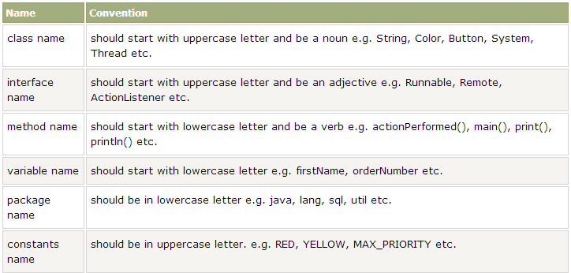

# Coding Style 

We will be using the java linter [checkstyle](https://checkstyle.sourceforge.io).

We will also follow the conventions outlined by the group who created the 
[cook-eBook](https://code.cs.umanitoba.ca/comp3350-summer2019/cook-eBook/-/blob/master/docs/Coding%20Style.md) 
app for this course 2 years ago.

## Naming

We will follow [this](https://www.diehardtechy.com/2014/02/java-naming-conventions.html) 
java naming convention guide with some additions. 



All shared variables (i.e. any in the "resource" folder) shall be lowercase 
with underscores separating words (Android Default)
```java
event_id
```

All Interface classes shall be prefixed with 'I'.
```java
IDatabase
```

## Format

All opening curly brackets shall sit *beside* the line, not under, followed by a newline.
```java
public boolean doMethod() {
```

All indents are four spaces. All indenting is done with tabs.

Matching braces always line up vertically in the same column as their construct.
```java
if(condition) {
    do thing
}
```

All classes shall be setup as follows:
```java
class Event {
    //fields
    
    //constructors
    
    //methods
    
    @override
    //methods
}
```

## Documentation

Your code should be simple enough to follow and self-explanatory such that 
in-line comments are not needed. However, [Javadoc](https://www.tutorialspoint.com/java/java_documentation.htm)'s can be useful to explain what the class or
method as a whole does, and tags can be included for author credit and dates.   


